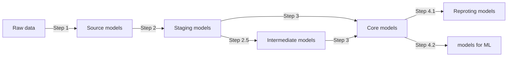

# DBT project:

## Folder Organisation
```
models
    ├──[Data source type] (for ex: Google Analytic) 
        ├── core
        ├── report
        ├── machine_learning
        ├── intermediate
        ├── staging
        └── source
```

## Graph data pipeline


### **Step 1**: Raw data --> Source models
- **Materialization: view**
- Models in folder models/[**Data source type**]/source (ex: models/google_analytic/source)
- One model for one raw table
- name: src_[**Data source type acronym**]_[**raw table name**]
ex: src_ga4_event
- rename column to english
- **NO**:
- SELECT *
- where condition
- window function
- calculation
- **Requirement**:
- Recast column
- Unnest (if having list in raw table)

### **Step 2**: Source model --> Staging models
- **Materialization: table/incremental**
- Models in folder models/[**Data source type**]/staging (ex: models/google_analytic/staging)
- one staging models for one source model
- name: stg_[**Data source type acronym**]_[**raw table detailed name**]
ex: stg_ga4_event_login
- **NO**:
- CTE (with data as (SELECT ...))
- Join models
- WHERE condition
- **Possible to have**:
- Window function
ex: row_number() over (partition by user_id order by updatedat desc) as rn_createdat
- Case - when - then - end statement
- Additional boolean logic True/False
ex: "user_id not null as is_with_user_id"

### **Step 2.5**: Staging model --> Intermediate models
- **Materialization: ephemeral**
- **Only use when neccesary** 
- Models in folder models/[**Data source type**]/intermediate (ex: models/google_analytic/intermediate)
- many intermediate models for one source model
- name: int_[**Data source type acronym**]_[**raw table detailed name**]
ex: int_ga4_event_login
- **Possible to have**:
- Window function
- Calculation
- Aggregation
- Additional boolean logic True/False


### **Step 3**: Staging model/Intermediate model --> Core models
- **Materialization: table**
- Models in folder models/[**Data source type**]/core (ex: models/google_analytic/core)
- Many core models for many staging (and one intermediate model)
Many staging models are used in the case of merging different Data source type (ex: merging between GA and CRM)
- Data source type can be merged in this step
- name: int_[**Data source type acronym**]_[**raw table detailed name**]
ex: int_ga4_event_login
- **Possible to have**:
- Window function
- Additional boolean logic True/False
ex: "user_id not null as is_with_user_id"
- Heavy calculation
- WHERE condition
- CTE
- **Requirement**:
- test dbt

### **Step 4.1**: Core models --> Reporting models
- **Materialization: table**
- Models in folder models/[**Data source type**]/report (ex: models/global/report)
- Data source type can be merged in this step
- many reporting models for one/many core model(s) (n:n)
- **Possible to have**:
- Window function
- Additional boolean logic True/False
ex: "user_id not null as is_with_user_id"
- Heavy calculation
- WHERE condition
- CTE
- Renaming column
- **Requirement**:
- test dbt

## Commands for daily/hourly job
- dbt build
- dbt test

## Commande for CI/CD job
- dbt build --select state:modified+


### Resources:
- Learn more about dbt [in the docs](https://docs.getdbt.com/docs/introduction)
- Check out [Discourse](https://discourse.getdbt.com/) for commonly asked questions and answers
- Join the [dbt community](http://community.getbdt.com/) to learn from other analytics engineers
- Find [dbt events](https://events.getdbt.com) near you
- Check out [the blog](https://blog.getdbt.com/) for the latest news on dbt's development and best practices
