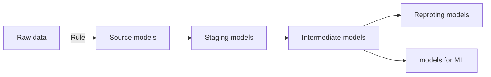

# DBT project:

## Folder Organisation
```
models
    ├──[Data source type] (for ex: Google Analytic) 
        ├── reporting
        ├── machine_learning
        ├── intermediate
        ├── staging
        └── source
```

## Graph data pipeline



## Commands for daily/hourly job
- dbt build
- dbt test

## Commande for CI/CD job
- dbt build --select state:modified+


### Resources:
- Learn more about dbt [in the docs](https://docs.getdbt.com/docs/introduction)
- Check out [Discourse](https://discourse.getdbt.com/) for commonly asked questions and answers
- Join the [dbt community](http://community.getbdt.com/) to learn from other analytics engineers
- Find [dbt events](https://events.getdbt.com) near you
- Check out [the blog](https://blog.getdbt.com/) for the latest news on dbt's development and best practices
